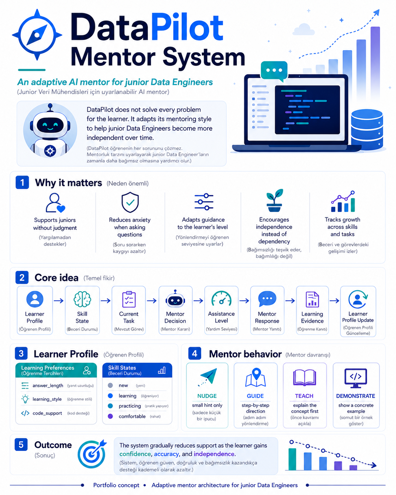
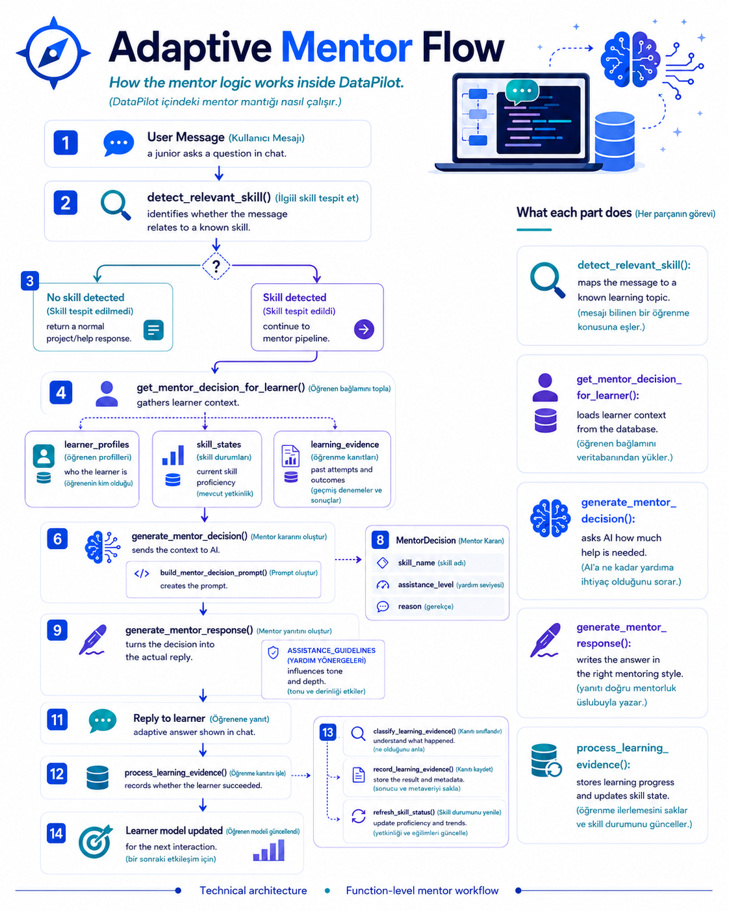

# DataPilot AI

DataPilot AI is an adaptive AI mentor designed for junior Data Engineers.

It combines learner profiles, skill tracking, learning evidence, and AI-driven mentoring decisions to provide the right amount of support at the right time.

The goal is not to solve every problem for the learner, but to help them become increasingly independent.

<p align="center">
  
</p>

## Key Features

- Adaptive mentoring based on learner skill state
- Skill detection from user messages
- Learner profiles and progress tracking
- Learning evidence classification
- Dynamic assistance levels: NUDGE, GUIDE, TEACH, DEMONSTRATE
- Conversation history for contextual mentoring
- RAG-based document question answering
- CSV profiling and AI-driven data quality recommendations


## How It Works

1. The user sends a question or code attempt.
2. DataPilot detects the relevant skill.
3. The learner profile, skill state, and previous learning evidence are loaded.
4. The AI selects the minimum sufficient assistance level.
5. A mentor response is generated using the conversation context.
6. The learner's next attempt is classified as learning evidence.
7. Skill progress is updated for future interactions.


## Adaptive Mentor Flow

<p align="center">
  
</p>

## Tech Stack

- Python
- FastAPI
- OpenAI API
- Pydantic
- SQLite
- Pandas
- Pytest

## Project Structure

```text
datapilot-ai/
├── backend/
│   ├── app/
│   │   ├── main.py
│   │   ├── chat_routes.py
│   │   ├── mentor_service.py
│   │   ├── database.py
│   │   ├── models.py
│   │   ├── rag_service.py
│   │   ├── retrieval_service.py
│   │   └── data_ai_service.py
│   ├── tests/
│   └── requirements.txt
├── data/
├── docs/
│   └── images/
├── README.md
└── .gitignore

## Project Status

DataPilot AI is currently under active development.

The adaptive mentor backend, conversation memory, skill tracking, learning evidence, RAG, and CSV profiling features are implemented and being refined.