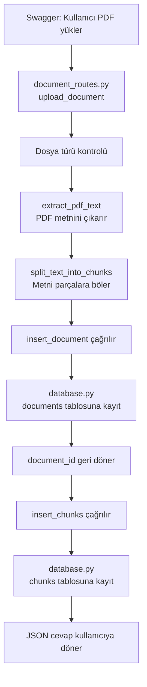

# Belge Yükleme Akışı

## Amaç

Kullanıcıdan PDF veya TXT dosyası almak, metni çıkarmak, küçük parçalara bölmek ve SQLite veritabanına kaydetmek.

## Dosyaların sorumlulukları

### `document_routes.py`

- Dosya yükleme isteğini karşılar.
- Dosya türünü kontrol eder.
- PDF veya TXT metnini çıkarır.
- Metni chunk'lara böler.
- Veritabanı fonksiyonlarını çağırır.
- Kullanıcıya JSON cevap döndürür.

### `database.py`

- SQLite bağlantısını açar.
- Belge bilgisini `documents` tablosuna kaydeder.
- Chunk'ları `chunks` tablosuna kaydeder.
- Oluşturulan `document_id` değerini geri döndürür.

## İşlem sırası

```text
1. Kullanıcı Swagger’dan PDF yükler
              ↓
2. document_routes.py
   upload_document(file) çalışır
              ↓
3. Dosya türü kontrol edilir
              ↓
4. extract_pdf_text(file) çalışır
   PDF → normal metin
              ↓
5. split_text_into_chunks(pdf_text) çalışır
   Metin → küçük parçalar
              ↓
6. insert_document(...) çağrılır
              ↓
7. database.py
   Belge bilgisi documents tablosuna kaydedilir
   document_id geri döndürülür
              ↓
8. document_routes.py
   insert_chunks(document_id, chunks) çağrılır
              ↓
9. database.py
   Chunk’lar chunks tablosuna kaydedilir
              ↓
10. document_routes.py
    JSON cevap kullanıcıya döner
```

## Şematik görünüm



## Temel görev ayrımı

```text
document_routes.py
→ Ne yapılacağını ve işlem sırasını yönetir.

database.py
→ Veritabanında işlemin nasıl yapılacağını gerçekleştirir.
```

## Oluşan veriler

```text
documents tablosu
id: 1
filename: Lessen met tekst.pdf
content_type: application/pdf

chunks tablosu
document_id: 1
chunk_index: 0
content: İlk metin parçası

document_id: 1
chunk_index: 1
content: İkinci metin parçası
```