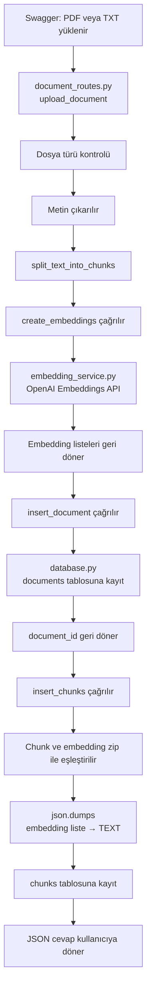

# Belge Yükleme Akışı

## Amaç

## Amaç

Kullanıcıdan PDF veya TXT dosyası almak, metni çıkarmak, küçük parçalara bölmek, her chunk için embedding oluşturmak ve chunk ile embedding’i SQLite veritabanına birlikte kaydetmek.

## Dosyaların sorumlulukları

### `document_routes.py`

- Dosya yükleme isteğini karşılar.
- Dosya türünü kontrol eder.
- PDF veya TXT metnini çıkarır.
- Metni chunk'lara böler.
- Veritabanı fonksiyonlarını çağırır.
- Kullanıcıya JSON cevap döndürür.
- Bütün chunk’ları `create_embeddings()` fonksiyonuna gönderir.
- Oluşan embedding listesini `insert_chunks()` fonksiyonuna verir.


### `embedding_service.py`

- OpenAI embedding istemcisini oluşturur.
- Tek bir metni embedding’e dönüştürmek için `create_embedding()` fonksiyonunu içerir.
- Birden fazla metni tek istekte dönüştürmek için `create_embeddings()` fonksiyonunu içerir.
- Metinleri sayı listeleri hâline getirir.

```text
create_embedding(text)
→ Tek bir metin alır
→ list[float] döndürür
```

### Kullanım örnekleri

```python
create_embedding("Soru")

# Dönen veri tipi:
# list[float]

# Örnek sonuç:
# [0.01, -0.02, ...]
```
create_embeddings(texts)
→ Birden fazla metin alır
→ list[list[float]] döndürür.
```

```python
create_embeddings(["chunk 1", "chunk 2"])

# Dönen veri tipi:
# list[list[float]]

# Örnek sonuç:
# [
#     [0.01, -0.02, ...],  # chunk 1'in embedding'i
#     [0.04, 0.03, ...],   # chunk 2'nin embedding'i
# ]
```

### `database.py`

- SQLite bağlantısını açar.
- Belge bilgisini `documents` tablosuna kaydeder.
- Chunk metinlerini ve embedding’lerini `chunks` tablosuna kaydeder.
- Embedding listesini `json.dumps()` ile JSON metnine dönüştürür.
- Veritabanından okurken `json.loads()` ile tekrar Python listesine dönüştürür.
- Oluşturulan `document_id` değerini geri döndürür.

## İşlem sırası

```text
1. Kullanıcı Swagger’dan PDF veya TXT yükler
              ↓
2. document_routes.py
   upload_document(file) çalışır
              ↓
3. Dosya türü kontrol edilir
              ↓
4. PDF ise extract_pdf_text(file) çalışır
   TXT ise dosya UTF-8 metnine dönüştürülür
              ↓
5. split_text_into_chunks(text) çalışır
   Metin küçük parçalara ayrılır
              ↓
6. create_embeddings(chunks) çağrılır
              ↓
7. embedding_service.py
   Chunk metinleri OpenAI embedding modeline gönderilir
   Her chunk için bir sayı listesi döner
              ↓
8. insert_document(...) çağrılır
              ↓
9. database.py
   Belge bilgisi documents tablosuna kaydedilir
   document_id geri döndürülür
              ↓
10. insert_chunks(
       document_id,
       chunks,
       chunk_embeddings
    ) çağrılır
              ↓
11. database.py
    Her chunk kendi embedding’iyle eşleştirilir
              ↓
12. Embedding listesi json.dumps() ile TEXT’e dönüştürülür
              ↓
13. Chunk ve embedding chunks tablosuna kaydedilir
              ↓
14. document_routes.py
    JSON cevap kullanıcıya döner
```


## Şematik görünüm



## Temel görev ayrımı

```text
document_routes.py
→ İşlem sırasını yönetir.
→ Dosyayı alır, metni çıkarır ve servisleri çağırır.

embedding_service.py
→ Metni embedding sayı listesine dönüştürür.
→ OpenAI ile iletişim kurar.

database.py
→ Verilerin SQLite’a nasıl kaydedileceğini ve okunacağını yönetir.
```

## Oluşan veriler

```text
documents tablosu

id: 1
filename: veri_donusum.txt
content_type: text/plain


chunks tablosu

document_id: 1
chunk_index: 0
content: İlk metin parçası
embedding: "[0.012, -0.034, 0.056, ...]"

document_id: 1
chunk_index: 1
content: İkinci metin parçası
embedding: "[-0.021, 0.043, -0.008, ...]"
```


## Embedding’in veritabanından okunması

Embedding veritabanına yazılırken:

```text
Python list[float]
↓
json.dumps()
↓
SQLite TEXT
```

Embedding veritabanından okunurken:
```
SQLite TEXT
↓
json.loads()
↓
Python list[float]
```

get_chunks_by_document() fonksiyonu SQLite’tan gelen sqlite3.Row satırlarını Python sözlüklerine dönüştürür.

```
sqlite3.Row
↓
{
    "chunk_index": 0,
    "content": "Metin parçası",
    "embedding": [0.012, -0.034, ...]
}
```
sqlite3.Row
↓
{
    "chunk_index": 0,
    "content": "Metin parçası",
    "embedding": [0.012, -0.034, ...]
}


Böylece bu dosya yalnızca eski belge yükleme sürecini değil, şu anda tamamladığımız **belge ingestion + embedding oluşturma + SQLite’a kaydetme + tekrar okuma** akışını eksiksiz anlatır.